### `prashant@github:~$ whoami`

<table>
<tr>
<td width="360" valign="top"></td>
<td width="490" valign="top"></td>
</tr>
</table>

**AI Engineer · Python Engineer · NLP / LLM Builder**

I build AI products, NLP systems and backend infrastructure with Python, LLMs and FastAPI. I’m pursuing an M.Sc. in Natural Language Processing at the University of Trier after production experience as a Junior AI/ML Backend Engineer at EnactOn Technologies.

### `prashant@github:~$ ./projects.sh`

**[Vidrial](https://github.com/Mr-Dark-debug/vid-story-prompt)** — AI-assisted video editor that turns authorised long-form media into reviewable edit plans, backed by Supabase and an external FFmpeg/Whisper worker. 
`AI workflows · TypeScript · Supabase · Cloudflare · FFmpeg`

**[PocketLLM](https://github.com/PocketLLM/PocketLLM)** — Cross-platform LLM client with a Python/FastAPI backend, encrypted bring-your-own keys, multi-provider catalogues and local Ollama support. 
`Python · FastAPI · LLMs · Ollama · Flutter`

**[LLM Linguistic Evaluation](https://github.com/Mr-Dark-debug/llm-pv-system)** — NLP research system for benchmarking phrasal-verb production across LLMs and measuring L2 learner avoidance. 
`Python · FastAPI · SQLAlchemy · spaCy · evaluation`

**[SMS AI Agent](https://github.com/Mr-Dark-debug/sms-ai-agent)** — On-device Android SMS agent with LLM provider adapters, rules, guardrails, rate limits and local persistence. 
`Python · LLMs · Ollama · FastAPI · SQLite`

**[CinePair](https://github.com/Mr-Dark-debug/cinepair)** — Desktop co-watching system with peer-to-peer media, WebRTC perfect negotiation and a FastAPI Socket.IO signaling service. 
`WebRTC · Python · FastAPI · Tauri · React`

### `prashant@github:~$ ./contributions.sh`

### `prashant@github:~$ ./connect.sh`

[Portfolio](https://prashant.sbs) · [LinkedIn](https://linkedin.com/in/mr-dark-debug) · [Technical blog](https://syntax-blogs.prashant.sbs) · [GitHub](https://github.com/Mr-Dark-debug)

